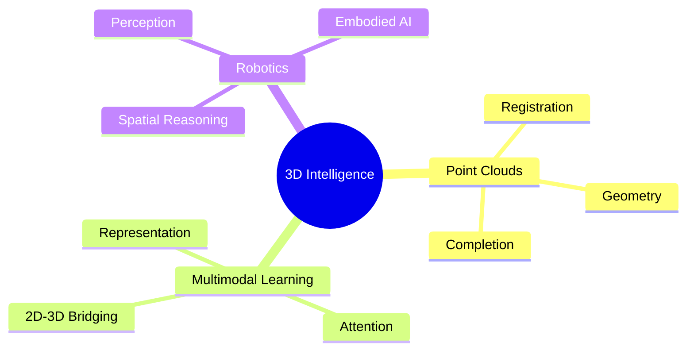

<div align="center">

<br>

# Li Zhaoyang

### Computer Science · 3D Perception · Multimodal Learning · Robotics

<p>
  <a href="https://zay002.github.io/">
    
  </a>
  <a href="https://scholar.google.com/citations?user=nxnkG4IAAAAJ">
    
  </a>
  <a href="https://huggingface.co/Zli002">
    
  </a>
  <a href="https://www.linkedin.com/in/zhaoyang-li-62b113240">
    
  </a>
</p>

<sub>
  I build perception systems that connect geometry, learning, and action.
</sub>

<br><br>

</div>

---

<table>
<tr>
<td width="62%" valign="top">

## Current Signal

```text
status      M.Sc. student @ Southwest Jiaotong University
focus       2D-3D bridging · point cloud completion · 3D perception
paper       SplAttN · ICML 2026 Spotlight
workflow    Codex + Claude Code + Python/C++/CUDA
looking     internship opportunities
```

I work on systems that connect **visual representations** with **3D geometric understanding**. My current research sits around point clouds, multimodal learning, robotics, and embodied AI.

</td>
<td width="38%" valign="top">

## Quick Links

| Channel | Link |
|:--|:--|
| Homepage | [zay002.github.io](https://zay002.github.io/) |
| Scholar | [Zhaoyang Li](https://scholar.google.com/citations?user=nxnkG4IAAAAJ) |
| Hugging Face | [Zli002](https://huggingface.co/Zli002) |
| LinkedIn | [Zhaoyang Li](https://www.linkedin.com/in/zhaoyang-li-62b113240) |
| Email | [lzy11@my.swjtu.edu.cn](mailto:lzy11@my.swjtu.edu.cn) |

</td>
</tr>
</table>

---

## Research Dashboard

<table>
<tr>
<td width="50%" valign="top">

### Spotlight Paper

**SplAttN: Bridging 2D and 3D with Gaussian Soft Splatting and Attention for Point Cloud Completion**

Accepted to **ICML 2026** as a **Spotlight** paper.

This project explores how 2D visual cues and 3D geometric structure can communicate more effectively for point cloud completion.

<p>
  <a href="https://arxiv.org/abs/2605.01466">
    
  </a>
  <a href="https://icml.cc/virtual/2026/poster/60900">
    
  </a>
  <a href="https://github.com/zay002/SplAttN-Public">
    
  </a>
</p>

</td>
<td width="50%" valign="top">

### Research Compass



</td>
</tr>
</table>

---

## Build Surface

| Surface | Keywords |
|:--|:--|
| **Research** | `Deep Learning` `Multimodal Learning` `3D Perception` `Point Cloud Understanding` `Robotics` `Embodied AI` |
| **Engineering** | `Python` `C++` `CUDA` `TypeScript` `JavaScript` `MATLAB` `SQL` `Bash` |
| **Workflow** | `Codex` `Claude Code` `Agentic Coding` `Fast Iteration` `Paper -> Prototype -> Demo` |
| **Interests** | `Algorithm Engineering` `Quantitative Research` `Game Technology` |

---

## GitHub Pulse

<div align="center">

<picture>
  <source media="(prefers-color-scheme: dark)" srcset="https://github-readme-stats-sigma-five.vercel.app/api?username=zay002&show_icons=true&theme=tokyonight&hide_border=true&count_private=true" />
  <source media="(prefers-color-scheme: light)" srcset="https://github-readme-stats-sigma-five.vercel.app/api?username=zay002&show_icons=true&theme=default&hide_border=true&count_private=true" />
  
</picture>

<picture>
  <source media="(prefers-color-scheme: dark)" srcset="https://github-readme-stats-sigma-five.vercel.app/api/top-langs/?username=zay002&layout=compact&theme=tokyonight&hide_border=true" />
  <source media="(prefers-color-scheme: light)" srcset="https://github-readme-stats-sigma-five.vercel.app/api/top-langs/?username=zay002&layout=compact&theme=default&hide_border=true" />
  
</picture>

<picture>
  <source media="(prefers-color-scheme: dark)" srcset="https://github-readme-activity-graph.vercel.app/graph?username=zay002&theme=tokyo-night&hide_border=true&area=true" />
  <source media="(prefers-color-scheme: light)" srcset="https://github-readme-activity-graph.vercel.app/graph?username=zay002&theme=react&hide_border=true&area=true" />
  
</picture>

</div>

---

<div align="center">

### Looking for internship opportunities

Algorithm engineering · Quantitative research · Game technology · 3D perception

<br>

<a href="mailto:lzy11@my.swjtu.edu.cn">
  
</a>

<br><br>

<sub>Last updated: May 14, 2026</sub>

</div>
